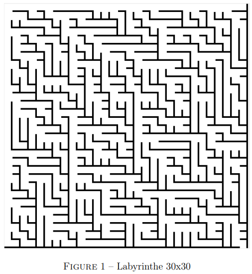
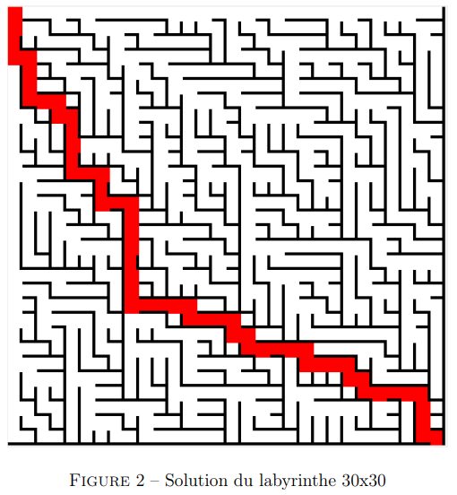

# Projet - Générateur de Labyrinthes

## Présentation du problème

Un labyrinthe est un réseau de chemins et d’embranchements dont le but est de trouver un chemin allant du départ jusqu’à la sortie. Un labyrinthe parfait est un labyrinthe où il n’existe qu’un seul chemin depuis l’entrée vers la sortie et où chaque cellule est reliée à toutes les autres de manière unique.

## Méthode de génération

### De manière générale

1. On commence avec une grille de dimensions H x L.
2. Chaque case de la grille est traitée une à une.
3. Pour chaque case, on choisit aléatoirement un voisin (à gauche ou au-dessus) et on ouvre un passage avec ce voisin.
4. On répète ce processus jusqu'à ce que toutes les cases soient traitées, créant ainsi un labyrinthe parfait.

### Avec les arbres binaires

1. Chaque case est représentée comme un nœud dans un arbre binaire.
2. La racine de l’arbre est la case de départ (0,0).
3. On crée une liste à deux dimensions pour contenir tous les nœuds.
4. On parcourt cette liste pour établir les relations parent-enfant entre les nœuds, créant ainsi le labyrinthe.

## Développement

Le projet est divisé en différentes parties, avec une difficulté croissante. 

### Partie 1 : Génération de labyrinthes

1. Compléter la méthode `genererLabyrinthe(self)` de la classe `Labyrinthe`.
2. Utiliser des arbres binaires pour générer un labyrinthe.
3. Tester la génération en affichant l’arbre correspondant.

### Partie 2 : Affichage du labyrinthe

1. Compléter la méthode `afficher(self)` de la classe `Labyrinthe`.
2. Utiliser le module `AfficheurLabyrinthe` pour aider à l’affichage.
3. Afficher le labyrinthe dans une fenêtre interactive.

### Partie 3 : Résolution du labyrinthe

1. Compléter la méthode `solution_recursif(self, debut, fin, chemin)` pour trouver un chemin de l’entrée vers la sortie.
2. Afficher la solution en rouge sur le labyrinthe.

### Partie 4 : Bonus

1. Apporter des améliorations à l’interface graphique.
2. Ajouter des fonctionnalités supplémentaires comme le placement aléatoire de l’entrée et de la sortie, ou un bouton pour afficher/masquer la solution.

## Rendus

Vous devrez rendre :
- Le(s) fichier(s) Python du projet.
- Un rapport de projet contenant :
  - Historique du projet.
  - Liste des fonctionnalités.
  - Difficultés rencontrées et solutions.
  - Planning et répartition du travail.

## Critères d’évaluation

- Fonctionnement du programme.
- Respect du cahier des charges.
- Niveau d’avancement du projet.
- Génération d’un labyrinthe sous forme d’arbre binaire.
- Tests inclus dans le code.
- Utilisation correcte des structures de données et de la programmation objet.
- Exploitation des bibliothèques `random` et `AfficheurLabyrinthe`.
- Noms de variables significatifs.
- Code commenté et documenté.
- Qualité du rapport.
- Répartition équitable du travail dans le groupe.
